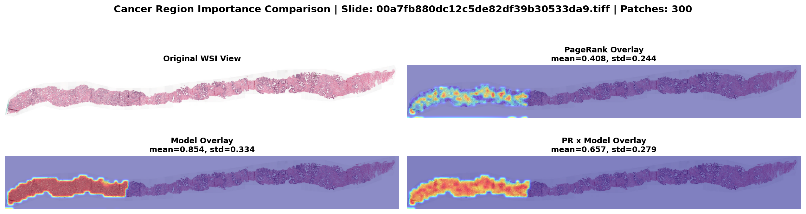

# OncoPRISM

OncoPRISM (Oncology PageRank-Informed Spatial Modeling) is a graph-based histopathology framework for whole-slide image (WSI) analysis. It combines patch-level deep features with graph structure and PageRank priors to improve both classification and interpretability.

## Overview

This repository contains:

- Patch-level graph baselines (GCN, PRGAT)
- WSI pipeline with ViT features and graph construction
- PageRank-guided importance scoring and overlay visualization
- Evaluation assets for paper-ready plots and tables

## Repository Structure

- onco-code/: notebooks, scripts, cached checkpoints, and evaluation outputs
- data/: PatchCamelyon and PANDA dataset files used in experiments
- results/: qualitative outputs and overlays
- onco-env/: local Python virtual environment

## Main Notebooks

- onco-code/OncoPRISM.ipynb: patch-level experiments with GCN and PRGAT
- onco-code/onco-wsi-pipeline.ipynb: WSI graph pipeline and qualitative overlays
- onco-code/research_paper_evaluation.ipynb: comparison metrics, plots, and exportable tables

## Setup

1. Create or activate a Python environment.
2. Install dependencies:

```bash
pip install -r requirements.txt
```

3. If using notebooks directly, ensure Jupyter is installed and open the notebooks in onco-code/.

## Evaluation Outputs

The evaluation notebook exports key figures to onco-code/eval-images/:

- ROC and PR curves
- Confusion matrices
- Calibration diagnostics
- Ablation study plots
- Error analysis and radar-style model comparison

Tabular outputs are exported to onco-code/evaluation_results/ (CSV, XLSX, and summary files).

## Results

### Cancer Importance Overlay (WSI)

The figure below shows the qualitative overlay comparison used in the report: original WSI context with PageRank/model-guided importance highlighting diagnostically relevant regions.




## Authors
- Sahil Narkhede (B23CS1060)
- Sarah Fatima (B23EE1093)
- Anshit Agarwal (B23CS1087)
